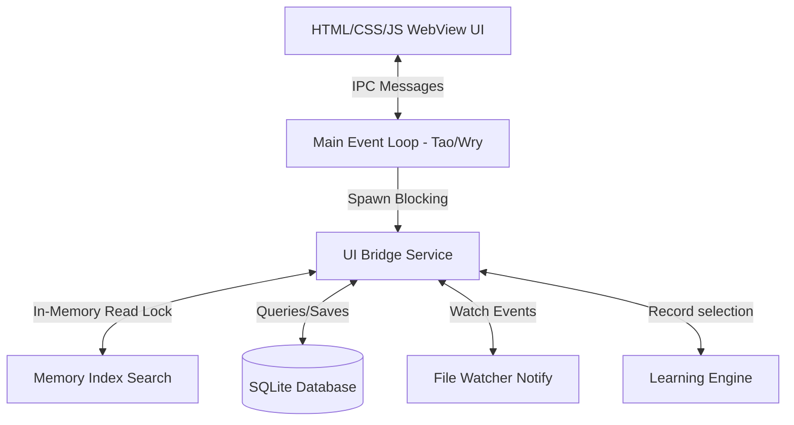

# Kelp


<div align="center">
  
  <p align="center">
    <strong>A fast, keyboard-driven desktop launcher for Windows.</strong>
  </p>
  <p align="center">
    <a href="https://github.com/Vibbudu/kelp/actions">
      
    </a>
    
    
    
    <a href="https://kelp-website.vercel.app/">
      
    </a>
  </p>

  <p align="center">
    <a href="https://kelp-launcher.vercel.app/"><strong> Official Website</strong></a>
  </p>
</div>

---

## Introduction

Kelp is a lightweight, keyboard-centric desktop search launcher for Windows that helps you find and open applications, shortcuts, folders, and files instantly. By combining a high-performance Rust indexing engine with a clean, hardware-accelerated webview interface, it achieves sub-millisecond search latency with minimal background resource usage.

Kelp runs quietly in the background and is summoned instantly using a global hotkey.

> [!NOTE]
> This project is currently in **Public Alpha**. Issues, feature suggestions, and pull requests are welcome.

---

## Key Features

* **Sub-Millisecond Search**: Fully in-memory candidate indexing using lock-free read structures.
* **Tiered Matching Logic**: Search terms are evaluated sequentially against Exact, Prefix, Acronym, CamelCase, Substring, and Fuzzy matches.
* **Adaptive Ranking**: Learns your launch habits (recency and frequency) to rank your favorite items higher over time.
* **Real-time File Watcher**: Automatically listens for file system creations, modifications, and deletions to update the index incrementally.
* **Extension Filtering**: Limit searches by typing extensions directly (e.g., `.pdf report` or `.exe`).
* **Minimal Footprint**: Operates with zero idle background CPU and tiny memory overhead.
* **Modern Interface**: Fluent-inspired glassmorphic design that adapts to system light and dark themes.

---

## Keyboard Shortcuts

* `Alt + Space` — Toggle show/hide the launcher window.
* `Arrow Up` / `Arrow Down` — Navigate the search results.
* `Enter` — Launch the selected file, folder, or application.
* `Escape` — Hide the launcher window.

---

## System Architecture

Kelp uses a thin-client architecture that separates the user interface from the core search engine:



* **Core Search Engine**: Written in Rust, running zero-copy algorithms under read locks.
* **SQLite Database**: Persists whitelisted file index cache and selection history.
* **File Watcher**: Listens to system events and propagates changes to the memory index in real-time.

---

## Installation

You can download the compiled installer from the [Releases](https://github.com/Vibbudu/kelp/releases) page.

1. Download `KelpSetup-v0.1.0-alpha.exe`.
2. Run the installer wizard to install Kelp.
3. Start Kelp from the Start Menu or desktop shortcut.

---

## Building from Source

### Prerequisites

* [Rust & Cargo](https://rustup.rs/) (Stable channel)
* Windows 10 or 11

### Run Development Build

1. Clone the repository:
   ```bash
   git clone https://github.com/Vibbudu/kelp.git
   cd kelp
   ```
2. Run the application:
   ```bash
   cargo run
   ```

### Compile Release Target

To generate a fully optimized production executable:
```bash
cargo build --release
```
The compiled binary will be placed at `target/release/kelp.exe`.

---

## Configuration

On first startup, Kelp creates a `config.json` file in its local AppData directory (`%LOCALAPPDATA%\Kelp\config.json`). You can customize the whitelisted file extensions there:

```json
{
  "supported_extensions": [
    "exe", "lnk", "pdf", "docx", "xlsx", "txt", "md", "png", "jpg", "zip", "rs"
  ]
}
```

---

## Roadmap

* [ ] System Tray integration for easy background state management.
* [ ] Direct web search keyword triggers (e.g. `g! query` to search Google).
* [ ] Customizable indexing path selections and blacklists.
* [ ] Native calculator and unit conversion tool.

---

## Contributing

Contributions are welcome. Please check [CONTRIBUTING.md](CONTRIBUTING.md) to get started.

---

## License

Distributed under the MIT License. See [LICENSE](LICENSE) for more information.
