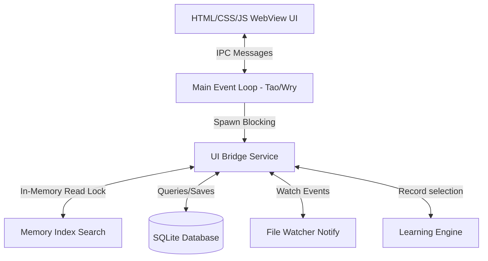

# 🚀 Nova Launcher

<!-- PROJECT LOGO PLACEHOLDER -->
<div align="center">
  
  <p align="center">
    <strong>Blazingly fast, lightweight, and beautiful keyboard-driven desktop launcher for Windows.</strong>
  </p>
  <p align="center">
    <a href="https://github.com/your-username/nova-launcher/actions"></a>
    
    
    
  </p>
</div>

---

## 🌟 Introduction

Nova Launcher is a modern keyboard-centric search launcher designed to help you find and open applications, shortcuts, folders, and files on Windows with zero friction. Powered by a Rust search engine and a thin webview client, Nova operates with **sub-millisecond search latencies** and zero background idle CPU.

> [!NOTE]
> This project is currently in **Public Alpha**. Issues, bug reports, and pull requests are highly welcome!

---

## ✨ Features

- **⚡ Blazingly Fast Search**: Sub-millisecond candidate lookup and matching entirely in-memory using lock-optimized index structures.
- **🎨 Glassmorphic UI**: High-legibility modern theme conforming automatically to system dark and light modes.
- **🗂️ Whitelisted Crawling**: Configurable file extension whitelisting to index files you actually care about while ignoring development junk.
- **🖥️ Sleep-Proof Hotkey**: Dedicated OS message hook thread intercepting `Alt + Space` globally to ensure launcher wakes up instantly.
- **🧠 Selection Learning**: Remembers launch frequency and recency, automatically bubbles up your favorite files for future searches.
- **🖼️ Real-time Icon Extraction**: Live extraction of Windows binary and shortcut icons into memory with thread-safe caching.
- **🔍 File Extension Filters**: Type `.pdf` or `.png` to immediately list files matching that extension.

---

## ⌨️ Keyboard Shortcuts

- `Alt + Space` - Toggle show/hide the launcher window.
- `Arrow Up` / `Arrow Down` - Navigate the search results list.
- `Enter` - Launch the selected item.
- `Escape` - Hide the launcher.
- `Mouse Move` - Slide the row selection overlay dynamically under the cursor.

---

## 🏗️ Architecture Overview

Nova Launcher utilizes a **Thin Client Architecture** separating UI and Search Engine logic:



- **Core Search Engine**: Performs acronym, prefix, contains, fuzzy, camel case, and exact matches.
- **SQLite Database**: Persists file metadata cache and learning selection stats.
- **File System Watcher**: Receives low-level events to update the index incrementally in real-time.

---

## 🚀 Getting Started

### Prerequisites

- [Rust & Cargo](https://rustup.rs/) (Stable channel)
- Windows 10 or 11

### Running from Source

1. Clone this repository:
   ```bash
   git clone https://github.com/your-username/nova-launcher.git
   cd nova-launcher
   ```
2. Run the application in development mode:
   ```bash
   cargo run
   ```
3. Press `Alt + Space` to summon the launcher.

### Running Optimizations (Release Build)

Build a fully optimized production executable:
```bash
cargo build --release
```
The compiled executable will be located at `target/release/nova-launcher.exe`.

---

## ⚙️ Configuration

The launcher generates a default `config.json` configuration file upon first startup in the current working directory. You can edit this file to customize the supported file extensions:

```json
{
  "supported_extensions": [
    "exe", "lnk", "pdf", "docx", "xlsx", "txt", "md", "png", "jpg", "zip", "rs"
  ]
}
```

---

## 🗺️ Roadmap

- [ ] System Tray integration for easy background management
- [ ] Direct Web search keyword support (e.g. `g! search query`)
- [ ] Customizable search paths and custom index exclusion filters
- [ ] Installer package using WiX or NSIS

---

## 🤝 Contributing

Contributions make the open-source community an amazing place! Please check [CONTRIBUTING.md](CONTRIBUTING.md) to get started.

---

## 📄 License

Distributed under the MIT License. See [LICENSE](LICENSE) for more information.
