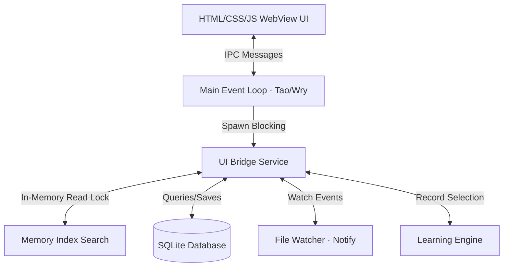

<div align="center">
  
</div>

<h1 align="center">Kelp</h1>

<p align="center">
  <strong>A fast, keyboard-driven desktop launcher for Windows.</strong><br />
  Sub-millisecond search. Zero idle CPU. No bloat.
</p>

<p align="center">
  <a href="https://kelp-launcher.vercel.app/">kelp-launcher.vercel.app</a>
</p>

<p align="center">
  <a href="https://github.com/Vibbudu/kelp/actions">
    
  </a>
  
  
  
</p>

---

## Downloads

> [!NOTE]
> Kelp is currently in **public alpha**. Expect rough edges — please report anything unexpected.

Grab the latest installer from the [Releases](https://github.com/Vibbudu/kelp/releases) page:

1. Download `KelpSetup-v1.0.0.exe`.
2. Run the installer.
3. Launch Kelp from the Start Menu or desktop shortcut.

> [!WARNING]
> During the installer wizard, **install Kelp to a folder under `Documents`** (e.g. `C:\Users\<you>\Documents\Kelp`) rather than the default `Program Files`. Installing inside `Program Files` is currently causing failures for some users due to permission restrictions on that directory. This will be fixed in a future release.

---

## Why Kelp

Most launchers ship as an Electron app wrapped around a search box. Kelp is built the other way around: a lock-free Rust indexing core paired with a thin, hardware-accelerated webview shell. The result is a launcher that opens instantly, searches instantly, and disappears from your resource monitor when idle.

- **Sub-millisecond search** — fully in-memory candidate indexing over lock-free read structures.
- **Tiered matching** — queries are evaluated through Exact, Prefix, Acronym, CamelCase, Substring, and Fuzzy tiers in sequence, so the most relevant result always wins.
- **Adaptive ranking** — learns from recency and launch frequency to surface what you actually use.
- **Real-time indexing** — a background file watcher keeps the index current as files are created, moved, or deleted.
- **Extension filters** — scope a search with a raw extension, e.g. `.pdf report` or `.exe`.
- **Minimal footprint** — zero idle CPU, negligible memory overhead.
- **Native feel** — a Fluent-inspired glassmorphic interface that follows your system theme.

---

## Keyboard Shortcuts

| Shortcut | Action |
| --- | --- |
| `Alt` + `Space` | Show / hide Kelp |
| `↑` / `↓` | Navigate results |
| `Enter` | Launch the selected item |
| `Esc` | Hide Kelp |

---

## Architecture

Kelp separates the interface from the search engine with a thin-client design: the UI never touches the index directly, and the Rust core never blocks on rendering.


```mermaid
graph TD
    UI[HTML/CSS/JS WebView UI] <-->|IPC Messages| Main[Main Event Loop · Tao/Wry]
    Main -->|Spawn Blocking| Bridge[UI Bridge Service]
    Bridge <-->|In-Memory Read Lock| Index[Memory Index Search]
    Bridge <-->|Queries/Saves| DB[(SQLite Database)]
    Bridge <-->|Watch Events| Watcher[File Watcher · Notify]
    Bridge <-->|Record Selection| Learning[Learning Engine]
```

- **Search core** — Rust, zero-copy candidate scanning under read locks.
- **SQLite** — persists the whitelisted file index cache and selection history.
- **File watcher** — propagates filesystem events to the in-memory index in real time.

---

## Building from Source

### Prerequisites

- [Rust & Cargo](https://rustup.rs/) (stable channel)
- Windows 10 or 11

### Development build

```bash
git clone https://github.com/Vibbudu/kelp.git
cd kelp
cargo run
```

### Release build

```bash
cargo build --release
```

The compiled binary is written to `target/release/kelp.exe`.

---

## Configuration

On first launch, Kelp writes a `config.json` to `%LOCALAPPDATA%\Kelp\config.json`. Whitelisted file extensions can be edited there:

```json
{
  "supported_extensions": [
    "exe", "lnk", "pdf", "docx", "xlsx", "txt", "md", "png", "jpg", "zip", "rs"
  ]
}
```

---

## Roadmap

- [ ] System tray integration for background state management
- [ ] Web search keyword triggers (e.g. `g! query` → Google)
- [ ] Customizable indexing paths and blacklists
- [ ] Native calculator and unit conversion

---

## Contributing

Contributions are welcome — see [CONTRIBUTING.md](CONTRIBUTING.md) to get started.

---

## License

Distributed under the MIT License. See [LICENSE](LICENSE) for details.
